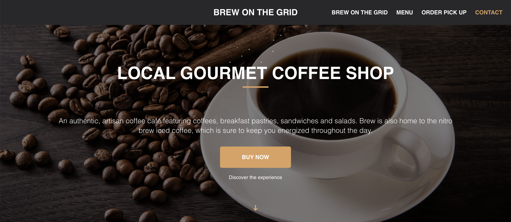
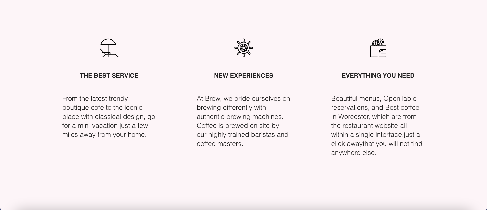
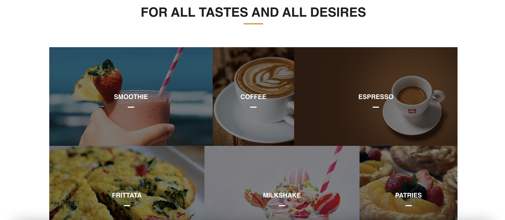
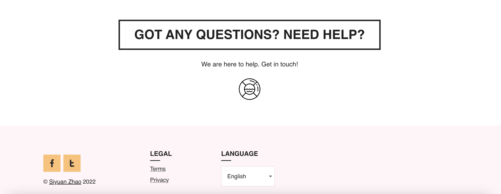

# MIS585 Assginment6
> MIS585 homework in Module 11 --- Assignment 7
# Introduction
> The project is a Front-end project without Back-end with React
  In this project, these components are come from <a href="https://mui.com/zh/">MUI</a>
# Using
```
git clone https://github.com/ScheWann/MIS585_Assginment7.git

cd MIS585_Assginment7

npm install

npm start

```
# ScreenShot
<h3>Homepage</h3>

<h3>Introduce</h3>

<h3>Category</h3>

<h3>Footer</h3>
